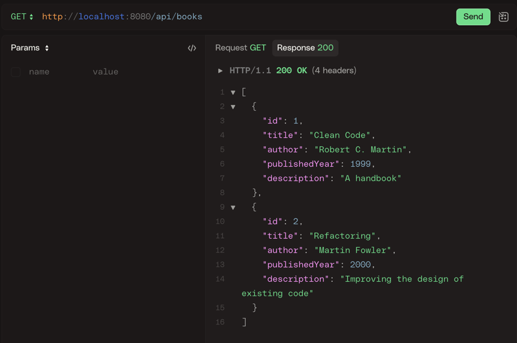
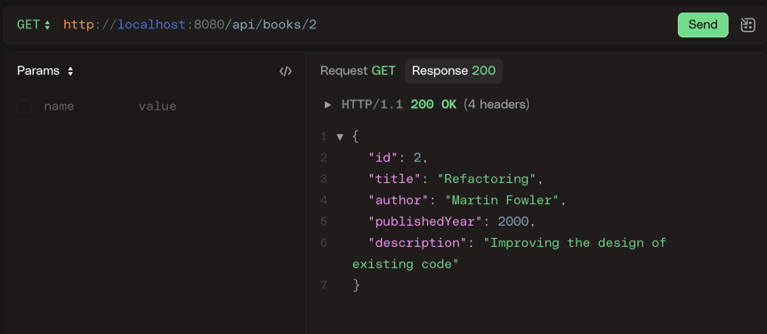
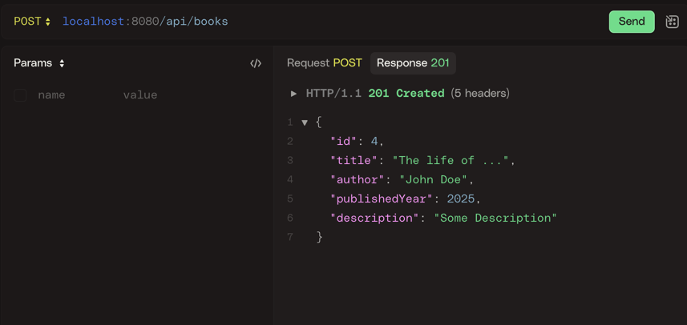
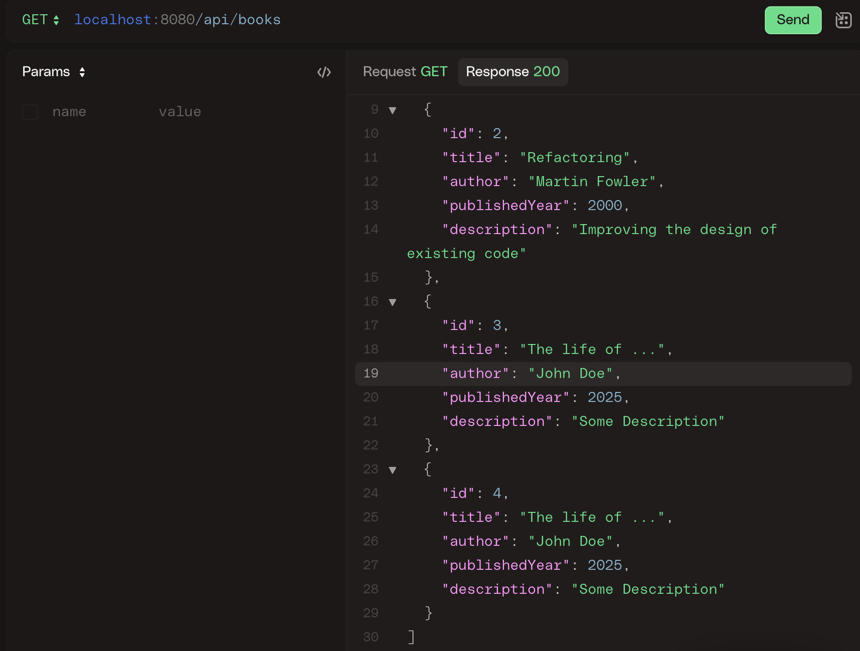
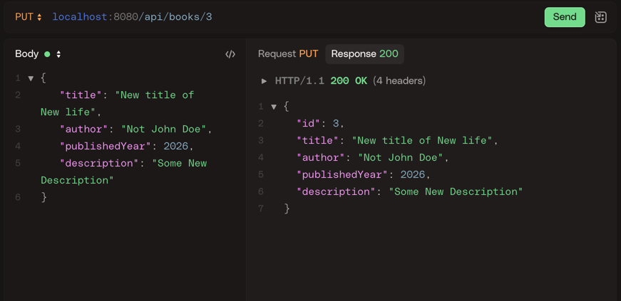
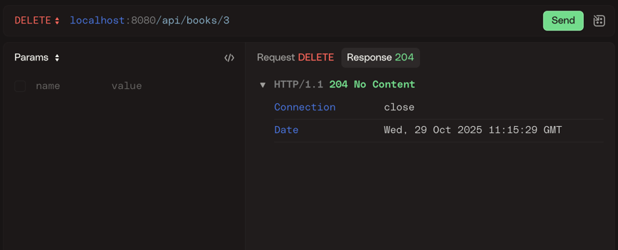
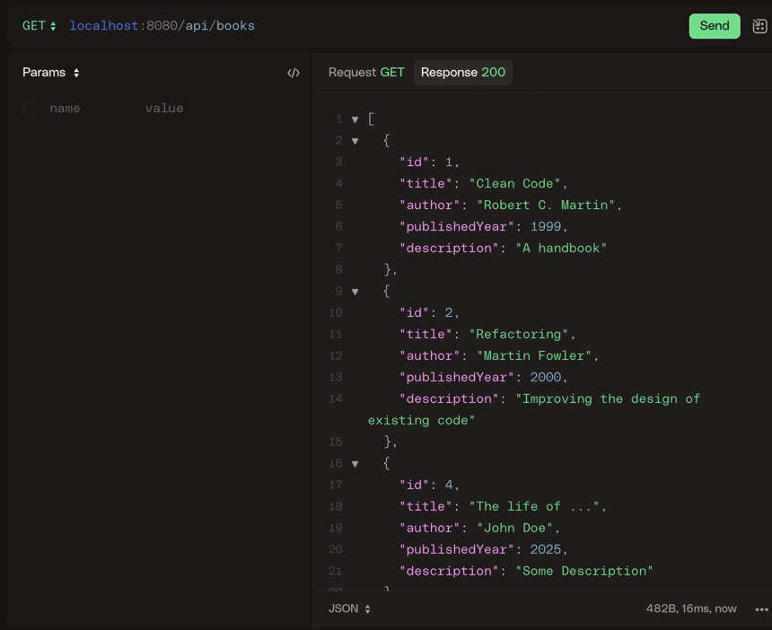
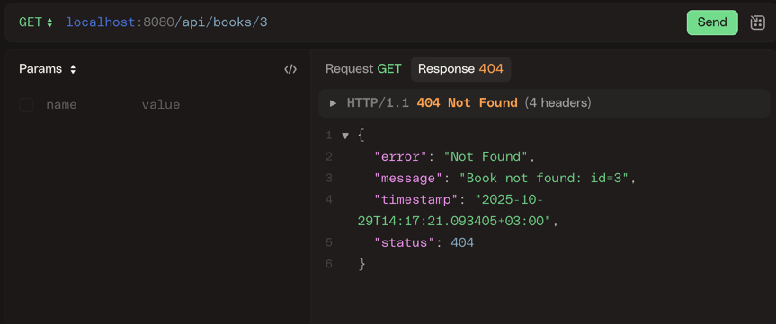

*Запуск PostgreSQL в Docker*
- ```docker run --name pg-books -e POSTGRES_PASSWORD=postgres -e POSTGRES_DB=books -p 5432:5432 -d postgres:16```


1. GET localhost:8080/api/books

2. GET localhost:8080/api/books/2

3. POST localhost:8080/api/books

4. PUT localhost:8080/api/books

Было:

Стало:

5. DELETE localhost:8080/api/books/3



